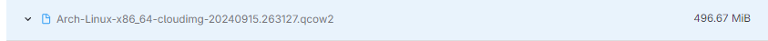

Creating a Remote Server on DigitalOcean with Arch Linux

**Table of contents**
1. **Generate SSH keys**
2. **Add SSH Key to DigitalOcean**
3. **Add a Custom Arch Linux Image**
4. **Create a Droplet Running Arch Linux**
5. **Using cloud-init for Automation**
6. **Connect to Your Droplet Using SSH**

1. **Generate an SSH Key**

What are SSH keys?
- SSH Keys are a secure authentication method for accessing remote systems. They consist of a public key store on the server, and a private key kept on your local machine. This eliminates the need for a password, providing a more secure way of logging in.

Steps to create an SSH key pair
On windows, you may have to create a .ssh directory in your home directory first.

~ = your home directory.

i. Open your terminal and run the following commmand: 

    ssh-keygen -t ed25519 -f ~/.ssh/do-key -C "your email address"

In powershell, Tilde does not always work. You may have to enter the full path. Replace "your-user-name" with your Windows user name, and "youremail@email.com" with your email account.

    ssh-keygen -t ed25519 -f C:\Users\your-user-name\.ssh\do-key -C "youremail@email.com"

ii. After running that command, you will recieve a prompt to enter a passphrase. You can leave this blank. If you do decide to create a passphrase, make sure to remember it/have it written down somewhere safe.

iii. You will recieve the key fingerprint. Select and copy your key fingerprint.

2. **Add your SSH Key to DigitalOcean**
    Why add SSH keys to DigitalOcean?
    Adding your SSH key to DigitalOcean will allow you to securely access any droplet you create, without the need to enter a password.

    1. Log in to digital ocean
    2. Navigate to Settings on the side bar
    3. Click Settings>Security>Add SSH Key
    4. Paste the previously copied randomart image into the SSH Key content
    5. Create a name for your SSH Key, click "Add SSH Key"

3. **Add a Custom Arch Linux Image**
    Why use a custom Arch Linux image?
    Arch Linux is not a default option on DigitalOcean, therefore, you will need to upload a custom image if you want to use it.

    Download the Arch Linux Image [here](https://gitlab.archlinux.org/archlinux/arch-boxes/-/packages/1545)
    
    Ensure you download this: 

4. **Create a Droplet Running Arch Linux**
    Why use SSH keys for droplet?

    1. Click on **droplets** on the side bar
    2. Under **Choose an image**, select **Custom Images** and pick the Arch Linux image you uploaded from earlier.
    3. Select the following options:
        - **Choose region**: San Francisco
        - **Droplet Type**: Share CPU, Basic
        - **CPU Options**: Premium AMD and $7/Month option
        - **Authentication Method**: SSH Key, select the SSH Key you created
    4. Click **Create Droplet**

5. **Using cloud-init for Automation**
    What is cloud-init?
    Cloud-init is a tool to automate the initilization of cloud instances during a system boot. It is useful for tasks like:
    - Setting up new users
    - Installing packages
    - Running scripts
    - Configuring networks without manual intervention
    [Red Hat Documentation](https://docs.redhat.com/en/documentation/red_hat_enterprise_linux/9/html/configuring_and_managing_cloud-init_for_rhel_9/introduction-to-cloud-init_cloud-content)

    **Adding the cloud-init 